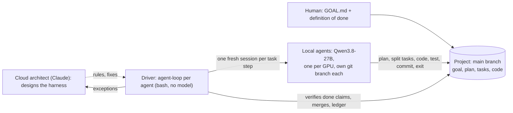

# Local AI Lab

A home lab that runs an open-weight coding model on consumer GPUs and lets autonomous agents build software with it,
unattended, for days. Everything here is the technical side: specs, code, configs, benchmark data and experiments.

**Current setup:** Qwen3.8-27B (4-bit) on two cards, one agent per card: an RTX 3090 Ti served by vLLM with the
HyperQwen patches (~100 tok/s, 150k-token context) and an RTX 5060 Ti served by llama.cpp (~28 tok/s, 114k). The
agents (the Pi coding agent plus this repo's extensions and driver) work in an isolated VM, one fresh session per step,
with their memory in files and git, and build the same project together, each on its own git branch.

**New here? Start with [How the harness works](docs/how-it-works.md)**: the pieces, a project from goal to finished
software, how several agents share one project, and which decisions are fixed rules and which are the agent's.

## Architecture

A cloud model designs, a script orchestrates, local agents implement:

- **Agents are spawned per task step and then discarded.** Each session starts with an empty context, reads the
  project's memory files and its task, does one step, writes its notes, commits and exits. No long-running agent, no
  context rot, no compaction; memory lives in files and git.
- **A cloud model is the architect.** It turns the human's intent into goals and designs the harness the agents work
  under. The local models do the implementation, around the clock.
- **The orchestrator is deliberately not a model.** Task selection, done-verification, context limits, merges and the
  team's scheduling are enforced by a script, so no model can talk its way past them.
- **The human owns "done".** Agents plan, split tasks and propose new ones; a task only counts as done when the
  human's acceptance criteria are met and the tests pass.
- **Several agents, one project.** Each agent works on its own branch; tasks are handed out by declared dependencies
  and files, the critical path first (the slow card takes tasks nothing waits on), and an agent with nothing to build
  prepares notes for the tasks that start next.

Why it is split this way: [docs/architecture.md](docs/architecture.md).

## Highlights

- The agent built a browser game from three successive design documents: ~7,400 lines of code, ~12,200 lines of tests
  (405 tests) and ~300 commits in ~40 hours of unattended work. One rejected "done" claim in ~180 sessions.
- Two agents on two cards built a personal reading feed (frontpage) from a one-page goal plus the operator's reviews:
  ~8,100 lines of application code, ~12,000 lines of end-to-end, integration and golden tests, 64 tasks; no task lost
  or done twice, every merge conflict sent back to the agent with the reason.
- The harness is designed from the agents' own session logs: every rule enforced in code held, and every rule written
  only as instructions failed. See [docs/agent-harness.md](docs/agent-harness.md).
- Letting the agent split and add its own tasks (the human keeps the acceptance criteria) finished a task in 9 sessions
  that had taken 24 sessions to get half done.
- Idle GPU time is measured and attacked: the slower agent was busy only 44% of its hours on the first team project;
  critical-path scheduling and prep sessions now give it work while it would have waited.
- Serving: 4-bit costs ~1.3% perplexity against 8-bit and doubles the speed; two agents on one card give only ~1.06x
  one agent (speculative decoding already uses the spare capacity), so the lab runs one agent per card. See
  [docs/ai-lab.md](docs/ai-lab.md).

## Layout

| Path | What |
|---|---|
| [docs/](docs/) | [how-it-works.md](docs/how-it-works.md): the guide, start here. [architecture.md](docs/architecture.md): the three layers and why. [agent-harness.md](docs/agent-harness.md): every rule with the incident behind it, measurements, decisions, experiments, commands. [ai-lab.md](docs/ai-lab.md): hardware, power and heat, serving, benchmarks, network and security, changelog. [effort-ab.md](docs/effort-ab.md): thinking-effort A/B test. [model-choice.md](docs/model-choice.md): 27B vs Flash-Next vs Swift. [type1.md](docs/type1.md): a small log-triage model. [history/](docs/history/): earlier write-ups |
| [server/](server/) | The GPU box: boot-time power limits, a thermal guard that stops a model server on overheating, vLLM (HyperQwen) and llama.cpp configs, the encrypted doorbell relay, benchmark scripts and raw results |
| [harness/](harness/) | The agents' VM: the driver (`agent-loop`, team mode, helpers), Pi extensions (hand-over, thinking budget, web research, requests to the human), the project template, operator tools (`agent-start`, `agent-watch`, ...), per-agent settings examples, system snippets |
| [analysis/](analysis/) | Session-log analysers used for every number in the docs, A/B test kits, stub-agent tests for the driver, monitors (team watcher, idle-time report) |

## Using it

The pieces assume the setup described in [docs/ai-lab.md](docs/ai-lab.md): model servers reachable on the agents'
machine at `127.0.0.1:<port>` (one SSH tunnel per port), and the Pi coding agent installed for an unprivileged user.

1. Copy `harness/driver/*` and `harness/tools/*` to `~/bin`, `harness/pi-extensions/*.ts` to
   `~/.pi/agent/extensions/`, `harness/template/` to `~/.agent-kit/template/`, and start from `harness/pi-config/` for
   Pi's `models.json` and `settings.json`.
2. **One agent:** make a folder in `~/projects/` with a `GOAL.md` (what you want, in your own words) and run
   `agent-start <name>`. The agent plans it, builds it and checks the result against the goal before the loop stops.
   Edit `GOAL.md` any time; the next session re-plans.
3. **A team:** one settings file per agent in `~/.agent-kit/agents/` (from `harness/agents/*.env.example`: model server,
   speed, size limits), then `agent-team init <name>` and `agent-team start <name>`.
4. Watch and steer: `agent-watch <name>` (or `<name>.<id>` for a team agent; type to message the agent),
   `agent-report ~/projects/<name>`, `agent-team status <name>`; stop with `agent-stop <name>` or
   `agent-team stop <name>`.

Configs ending in `.example` have placeholders (`<...>`, `CHANGE-ME`) in place of addresses, account names and secrets.

## Publishing hygiene

Addresses, VLAN numbers, account names, keys and raw agent session logs are kept out of this repository. A gitleaks
pre-commit hook checks every commit for secrets: run `scripts/install-hooks.sh` once after cloning.

## Credits

- [Pi coding agent](https://github.com/earendil-works/pi) (the harness these extensions plug into)
- [HyperQwen](https://github.com/syv-ai/HyperQwen) (the vLLM build and model recipe) and [vLLM](https://github.com/vllm-project/vllm)
- [llama.cpp](https://github.com/ggml-org/llama.cpp), [SearXNG](https://github.com/searxng/searxng), [trafilatura](https://github.com/adbar/trafilatura)
- Qwen3.8-27B by the Qwen team

Built with Claude (Anthropic) as architect and pair; the agents' code is written by the local model.
