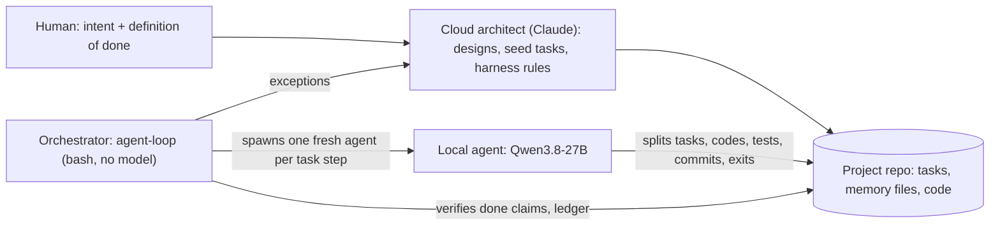

# Local AI Lab

A home lab that runs an open-weight coding model on consumer GPUs and lets an autonomous agent build software with it,
unattended, for days. Everything here is the technical side: specs, code, configs, benchmark data and experiments.

**Current setup:** Qwen3.8-27B (4-bit) on one RTX 3090 Ti, served by vLLM with the HyperQwen patches at ~100 tok/s and a
150k-token context. The agent (the Pi coding agent plus this repo's extensions and driver) works in an isolated VM,
one fresh session per step, with its memory in files and git.

## Architecture

A cloud model designs, a script orchestrates, local agents implement:

- **Agents are spawned per task step and then discarded.** Each session starts with an empty context, reads the
  project's memory files and its task, does one step, writes its notes, commits and exits. No long-running agent, no
  context rot, no compaction; memory lives in files and git.
- **A cloud model is the architect.** It turns the human's intent into design documents and seed tasks with acceptance
  criteria, and designs the harness the agents work under. The local model does the implementation, around the clock.
- **The orchestrator is deliberately not a model.** Task selection, done-verification, loop detection and context
  limits are enforced by a script, so no model can talk its way past them.
- **The human owns "done".** Agents split tasks into their own subtasks and propose new ones; a task only counts as done
  when the human's acceptance criteria are met and the tests pass.

Full description: [docs/architecture.md](docs/architecture.md).

## Highlights

- The agent built a browser game from three successive design documents: ~7,400 lines of code, ~12,200 lines of tests
  (405 tests) and ~300 commits in ~40 hours of unattended work. One rejected "done" claim in ~180 sessions.
- The harness is designed from the agent's own session logs: every rule enforced in code held, and every rule written
  only as instructions failed. See [docs/agent-harness.md](docs/agent-harness.md).
- Letting the agent split and add its own tasks (the human keeps the acceptance criteria) finished a task in 9 sessions
  that had taken 24 sessions to get half done.
- Serving: 4-bit costs ~1.3% perplexity against 8-bit and doubles the speed; one agent uses about half the GPU (a
  second concurrent request raised combined output from 78 to 192 tok/s). See [docs/ai-lab.md](docs/ai-lab.md).

## Layout

| Path | What |
|---|---|
| [docs/](docs/) | [architecture.md](docs/architecture.md): the three layers (cloud architect, script orchestrator, per-task local agents). [ai-lab.md](docs/ai-lab.md): hardware, power and heat, serving, benchmarks, network and security, changelog. [agent-harness.md](docs/agent-harness.md): the agent loop, design principles, measurements, decisions, experiments, plans. [history/](docs/history/): earlier write-ups |
| [server/](server/) | The GPU box: boot-time power limits, a thermal guard that stops the model server on overheating, vLLM (HyperQwen) and llama.cpp configs, benchmark scripts and raw results |
| [harness/](harness/) | The agent's VM: the loop driver (`agent-loop`) and helpers, Pi extensions (hand-over, status footer, thinking budget, web research), the project template, web tools, system snippets |
| [analysis/](analysis/) | Session-log analysers used for every number in the docs, the hand-over A/B test, stub-agent tests for the driver, monitoring scripts |

## Using it

The pieces assume the setup described in [docs/ai-lab.md](docs/ai-lab.md): a model server reachable on
`127.0.0.1:8080` from the agent's machine (an SSH tunnel), and the Pi coding agent installed for an unprivileged user.

1. Copy `harness/driver/*` to `~/bin`, `harness/pi-extensions/*.ts` to `~/.pi/agent/extensions/`, and start from
   `harness/pi-config/` for Pi's `models.json` and `settings.json`.
2. `newproj <name>` scaffolds a project from `harness/template/`; add one seed task (`tasks/001-<name>.md`: a goal and
   acceptance criteria), then run `agent-loop ~/projects/<name>`.
3. `agent-report ~/projects/<name>` shows per-task and per-session results; `touch <project>/.agent/PAUSE` stops the
   loop cleanly between sessions.

Configs ending in `.example` have placeholders (`<...>`, `CHANGE-ME`) in place of addresses, account names and secrets.

## Publishing hygiene

Addresses, VLAN numbers, account names, keys and raw agent session logs are kept out of this repository. A gitleaks
pre-commit hook checks every commit for secrets: run `scripts/install-hooks.sh` once after cloning.

## Credits

- [Pi coding agent](https://github.com/earendil-works/pi) (the harness these extensions plug into)
- [HyperQwen](https://github.com/syv-ai/HyperQwen) (the vLLM build and model recipe) and [vLLM](https://github.com/vllm-project/vllm)
- [llama.cpp](https://github.com/ggml-org/llama.cpp), [SearXNG](https://github.com/searxng/searxng), [trafilatura](https://github.com/adbar/trafilatura)
- Qwen3.8-27B by the Qwen team

Built with Claude (Anthropic) as architect and pair; the agent's code is written by the local model.
