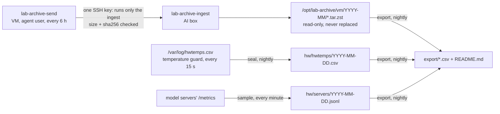

# Lab archive

Everything the agents did, kept on the AI box for good (at least a year: it feeds a business-analysis capstone), and
the tables to analyse it with.

Why it is needed: the lab console keeps only each agent's last two sessions, in memory. The history lives on the
harness VM, where the agents run as root, and the VM's disk fills in weeks at three agents' pace (frontpage wrote
~3 GB in its first 5 days).



- **What is shipped:** for each project named in `~/.agent-kit/archive-projects` on the VM (a team name takes its
  checkouts), every file under `.agent/` that is new or changed since the last run (sessions, ledger, loop log, team
  events, requests, prep notes), and a git bundle of the repository (every branch) whenever a branch moved. A project
  not in the list is never read; one in `~/.agent-kit/dashboard-hidden` is never shipped even if listed.
- **Kept for good:** nothing deletes an upload or a sealed day. The VM's key can only add: the ingest writes a new
  file and refuses anything incomplete, not zstd, over 8 GiB, or arriving while the disk has under 100 GiB free.
  Space: roughly 15-30 GB a year compressed.
- **One copy.** The archive is on the AI box's disk only. Copy `/opt/lab-archive` elsewhere if losing it would hurt.

## Use the data

The nightly export is in `/opt/lab-archive/export/` with a README of every table and column: sessions (tokens, time,
outcome, GPU energy), tasks, waits, team events, hardware per minute, model servers per minute. To the Mac:

```
scp -r aibox:/opt/lab-archive/export ~/capstone-data
```

Rebuild it now: `ssh aibox sudo -u labarchive lab-archive export`.

## Operate

| To | Run |
|---|---|
| Install or update (from the Mac) | `archive/deploy/push` (code), first time `AIBOX_ADDR=... VM_ADDR=... archive/deploy/push setup` |
| Archive a new project | on the VM: `echo <name> >> ~agent/.agent-kit/archive-projects` |
| Ship now | on the VM: `sudo systemctl start lab-archive-send` (log: `journalctl -u lab-archive-send`) |
| Check | on the AI box: `ls /opt/lab-archive/vm/*/`, `journalctl -u lab-archive@nightly` |
| Test | on the AI box: `bash archive/tests/test_archive.sh` |

Files: `lab-archive-send` (VM), `lab-archive-ingest` and `lab-archive` (AI box), `deploy/` (units, config, push).
