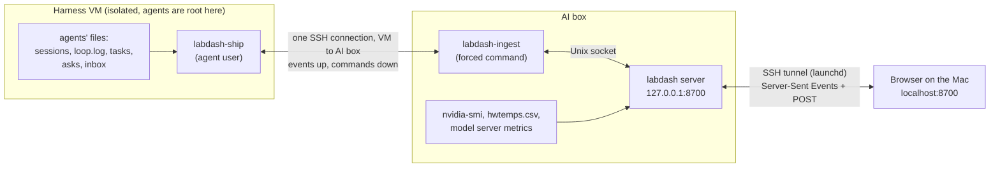

# The lab console

One web page for the whole lab: every agent's live work side by side (thinking, answers, tool calls with their diffs
and output, the driver's lines), each agent's task in full, the requests waiting for the operator, the sprint board,
and the AI box's hardware. The operator can message an agent, stop its session with a message, and answer its
requests from the page. It replaces SSH-ing into the VM and running `agent-watch` once per agent.

It runs on the AI box and is open only to the operator's Mac, at `http://localhost:8700` through an SSH tunnel that
launchd keeps up.

## The views

| View | What it shows |
|---|---|
| **Live** | All agents at once, like terminal windows on one monitor: one tall pane, the others stacked beside it (the arrows button swaps which one is tall). Each pane: the agent's GPU, task, speed, context, KV pool, session time, its feed, and a message box. |
| **Board** | Requests waiting for you, with an answer box, then each project's sprint as three columns: done, being built (with its agent and acceptance boxes ticked), not started (with what it waits for, or "ready to start"). |
| **Hardware** | One card per GPU (temperature, power against its cap, fan, load, memory, model server speed) and the CPU; the last hour of temperature and power as charts, with the temperature guard's thresholds; a table view. |
| **Agent** (one per agent) | The full feed with a composer (Send, or Stop session & send), and the task panel: goal, acceptance boxes, depends on / unlocks, files it touches, every session on this task, prep notes, `PROGRESS.md`, open requests, this session's numbers. |

What the numbers mean:

- **tok/s**: the model server's output speed right now (vLLM: generated tokens over the last 3 seconds; llama.cpp:
  the running request's decode rate). "reading prompt 40%" while llama.cpp processes a prompt.
- **ctx 70k/150k**: tokens in the agent's context after its last reply, out of the model's window. The session hands
  over before it fills.
- **KV pool** (vLLM only): how much of the card's context cache is in use.
- **session**: how long the current session has run.
- **Stream stuck**: no new event from an agent for 90 seconds while its model server is generating or reading a
  prompt and its session is running. The pane turns amber and offers Reconnect. Long quiet stretches without the model
  working (tests running, waiting on a merge) are normal and not flagged.

## How the data gets there



1. **labdash-ship** runs on the VM as the agent user. It follows each agent's newest Pi session file and its
   `loop.log`, turns Pi's raw events into the console's events (a thinking block, a tool call and later its result),
   and sends one JSON object per line. Every 10 seconds it also sends each agent's task panel and each project's sprint,
   only when they changed.
2. It sends them over **one SSH connection** to the AI box. The key it uses can run exactly one program there,
   `labdash-ingest` (a *forced command*: `command=` in `authorized_keys` runs that program whatever the client asks
   for, so the key cannot open a shell or forward ports). Ingest just joins the SSH session to the server's Unix
   socket.
3. **labdash** (the server) keeps the last two sessions of each agent in memory, samples the hardware itself every 3
   seconds, and pushes everything to the browser as **Server-Sent Events** (one long HTTP response the server keeps
   writing to; the browser's `EventSource` reconnects on its own if it drops).
4. The operator's messages and answers go back down the same SSH connection; the shipper writes them into the agent's
   `.agent/inbox/` or `.agent/asks/<n>.md` exactly as `agent-watch` and `agent-talk` do, and acknowledges each one.
   Nothing on the AI box ever connects to the VM, so the firewall stays one-way.

## Security

The VM is treated as hostile: its agents run as root there (`sudo apt-get`), so anything the shipper sends could have
been written by an agent. The design follows from that.

- **Data, never code, from the VM.** The page's code comes from the AI box. Agent text is only ever set as text
  (`textContent`), never parsed as HTML, so an agent writing `<script>` into its reply shows the characters. A strict
  Content Security Policy (only the server's own script, no inline script) backs that up. The server also caps the
  size and nesting of everything it receives and validates channel names.
- **Each key does one thing.** The VM's key runs only `labdash-ingest`, only from the VM's address. The Mac's key can
  only forward to `127.0.0.1:8700` on the AI box, only from the home network, with no shell. Both accounts are separate
  from every other identity, so each can be revoked alone and shows up by name in the auth log.
- **Localhost only.** The server listens on `127.0.0.1`; the tunnel is the only way in from outside the box.
- **No DNS rebinding.** A web page on another site could point its own domain name at `127.0.0.1` and read the
  console from the operator's browser. The server refuses any request whose `Host` header is not `localhost:8700`.
- **No cross-site requests.** Every POST must carry the header `X-Labdash: 1` and a same-origin `Origin`. A page on
  another site cannot add a custom header without a CORS preflight, which this server never grants, so it cannot send
  messages to the agents through the operator's browser.
- **The service account** runs under systemd hardening (read-only system, no home directories, no privilege gain);
  only its group can reach the ingest socket.
- **Hidden projects.** The shipper ships only the projects it is told to: `--only a,b`, or every project except those
  listed in `~/.agent-kit/dashboard-hidden` (one per line). A hidden project is dropped by name before any of its
  files are opened, and without that file (and without `--only`) nothing is shipped at all. The hardware view still
  shows a hidden project's GPU, without its name.

## Files

| Path | What |
|---|---|
| [ship/labdash-ship](ship/labdash-ship) | The shipper (VM) |
| [server/labdash](server/labdash) | The server (AI box) |
| [server/labdash-ingest](server/labdash-ingest) | The forced command that joins SSH to the server's socket |
| [server/config.example.json](server/config.example.json) | Server config: which GPU serves which model port |
| [web/](web/) | The page: `index.html`, `app.js`, `app.css` (no build step, no libraries) |
| [deploy/](deploy/) | systemd units, `authorized_keys` lines, the VM's SSH config, the Mac's launchd tunnel, and `push` |
| [tests/test_e2e.py](tests/test_e2e.py) | End-to-end test: shipper, ingest, server and the page, against a fake projects tree |

## Install (once)

On the AI box (Ubuntu, Python 3):

1. Accounts: a service user and group for the server (no login), a feed account with shell `/bin/sh` and a locked
   password in that group, and a view account with shell `/usr/sbin/nologin`.
2. Code: `labdash` and `web/` into `/opt/labdash/`, `labdash-ingest` into `/usr/local/bin/`.
3. Config: `config.example.json` to `/etc/labdash/config.json` (readable by the service group), with each model
   port's GPU UUID from `nvidia-smi --query-gpu=uuid,name --format=csv`.
4. The unit: [deploy/labdash.service.example](deploy/labdash.service.example), then `systemctl enable --now labdash`.

On the VM:

5. An ed25519 key for the agent user (`~/.ssh/labdash_feed_ed25519`, no passphrase) and the `Host labdash-feed` block
   from [deploy/ssh-config-labdash-feed.example](deploy/ssh-config-labdash-feed.example). Its public key goes in the
   feed account's `authorized_keys` on the AI box, as in [deploy/authorized_keys.example](deploy/authorized_keys.example).
6. The shipper into `/opt/labdash/`, the unit [deploy/labdash-ship.service.example](deploy/labdash-ship.service.example),
   `systemctl enable --now labdash-ship`. Write `~/.agent-kit/dashboard-hidden` first, or add `--only <project>`.

On the Mac:

7. A key `~/.ssh/labdash_view_ed25519` (no passphrase; it can only open the tunnel), its public key in the view
   account's `authorized_keys`, then [deploy/labdash-tunnel.plist.example](deploy/labdash-tunnel.plist.example) into
   `~/Library/LaunchAgents/` and `launchctl bootstrap gui/$(id -u) <plist>`.

## Update

```
dashboard/deploy/push          # both ends; or: push aibox | push vm
```

## Test

```
python3 dashboard/tests/test_e2e.py <any .agent/sessions/iter-*.jsonl>
```

Feeds a real session file into a fake team worktree the way Pi writes it, with an operator message and a reply
containing HTML spliced in, and checks everything between the agent's files and the page (80+ checks, about 10
seconds). The page checks run in jsdom: `npm i jsdom` in any directory, then set `NODE_PATH=<dir>/node_modules`.

## When something looks wrong

| You see | What it means | What to do |
|---|---|---|
| Red banner "console server is unreachable" | The page lost the server: the tunnel or the AI box is down | The page retries every 2 seconds and launchd restarts the tunnel; `/tmp/labdash-tunnel.log` on the Mac says why |
| Banner "link from the agent VM is down" | The shipper's SSH connection dropped; streams stay where they stopped, hardware stays live | The shipper reconnects on its own; `journalctl -u labdash-ship` on the VM |
| An amber pane, "stream stuck" | No events for 90 s while the model works | Reconnect on that pane (or `R` on an agent's page) replays its session from the file |
| A message stays "sending…" | No acknowledgement from the shipper | The link is down; nothing was written. Send it again when it is back |
| Anything else | | Reconnect all, then `journalctl -u labdash` on the AI box |
