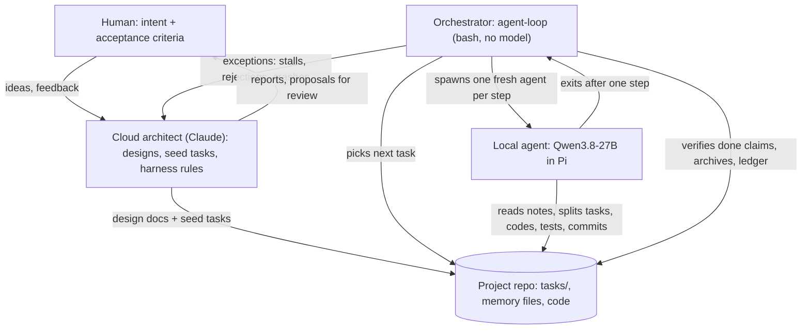

# Architecture: a cloud architect, a deterministic orchestrator, disposable local agents

The lab splits software work across three layers, each doing what it is best at:

| Layer | Who | Does | Never does |
|---|---|---|---|
| **Intent** | The human | Says what should exist and what "done" means (acceptance criteria), reviews new tasks the agents propose, plays and judges the result | Write the code |
| **Architect** | A cloud model (Claude) | Turns the human's intent into design documents and seed tasks with acceptance criteria; designs and maintains the harness (the rules, tools and checks the agents work under); investigates exceptions such as stalls, rejected work or crashes | Micromanage the agents or re-plan their tasks |
| **Orchestrator** | `agent-loop`, a bash script with no model in it | Picks the next task, spawns a fresh agent for one step of it, verifies every "done" claim, archives finished work, records every session in a ledger | Make judgment calls |
| **Implementers** | Local agents: Qwen3.8-27B in the Pi coding agent, on the lab's own GPU | Split tasks into subtasks, write the code and tests, run them, write their notes, commit, exit | Change what "done" means |

## Why split it this way

- **The expensive judgment is used where it pays.** Design, decomposition into good tasks, and the rules of the harness decide whether a long project goes well. A frontier cloud model is much better at those than the local model, but it is rate-limited and not free. The bulk of the typing, testing and debugging is done by the local model, around the clock, for the cost of electricity.
- **Supervision lives outside every model.** Loop detection, done-verification and context limits are enforced by a script. A model that has lost track of what it is doing cannot be relied on to notice; a bash `if` on a test exit code cannot be talked into "basically passing".
- **The human owns the definition of done.** Acceptance criteria are the human's. The agents decide how to get there, split work into their own subtasks and propose new tasks (bugs, refactors, features they think are missing), but a task only counts as done when the human's criteria are met and the tests pass.

## Agents are spawned per task step, and then they are gone

There is no long-running agent. For every step of every task the orchestrator starts a fresh agent session with an empty context, gives it one task file, and lets it work until it has done one step, written its notes and committed, or until the harness tells it to hand over. Then the session ends and the next one starts from scratch.

- **Memory lives in files and git, not in the model.** Each agent starts by reading the project's memory files (current state and next step, a journal of decisions and dead ends, a generated code map, its task file) and `git log`, and leaves them updated for the next one. If it is not written down, the next agent does not know it.
- **No context rot and no compaction.** A long-running session slowly fills its context, gets summarized, and continues with a blurred memory of its own work. Short, fresh sessions avoid that entirely; the harness cancels compaction and enforces a hand-over when the context gets full.
- **Failures stay small.** A session that goes wrong loses at most one step; its uncommitted code is saved by the orchestrator, and the next agent reads what happened in the journal.
- **Agents scope their own work.** A task that turns out too big is split by the agent itself into subtasks (`025a`, `025b`, ...), which the orchestrator then hands out before coming back to the parent.

## The architect's job, concretely

1. Take an idea ("make it a top-down looter shooter"), ask the questions that matter, and write a design document.
2. Turn the design into a queue of top-level tasks, each with a goal and acceptance criteria that define done.
3. Build the harness: the orchestrator, the agent extensions (hand-over, thinking budget, web research, image budget), the project template and its rules, all designed from the agents' own session logs rather than from assumptions.
4. Watch for exceptions only (stalls, repeated rejections, crashes, proposals that need the human) and fix the harness when the data says so. Every harness change is measured before and after with the session ledger.

## Where each piece lives

| Piece | Where |
|---|---|
| Orchestrator and helpers | [harness/driver/](../harness/driver/) |
| Agent-side extensions | [harness/pi-extensions/](../harness/pi-extensions/) |
| Rules every agent reads (`AGENTS.md`) and the project template | [harness/template/](../harness/template/) |
| Model server (the GPU box) | [server/](../server/) and [ai-lab.md](ai-lab.md) |
| Design principles, measurements, decisions, experiments | [agent-harness.md](agent-harness.md) |

## Planned

- **Two implementers on one project** when a second GPU arrives: one model copy per card, each agent in its own git worktree, a scheduler that hands a task to one agent at a time based on declared dependencies, and merges after verification. See [agent-harness.md](agent-harness.md).
- **A kickoff flow:** from a one-line idea, an agent drafts the design and proposes the task queue, and the human approves the acceptance criteria, so the architect is needed less for routine projects.
