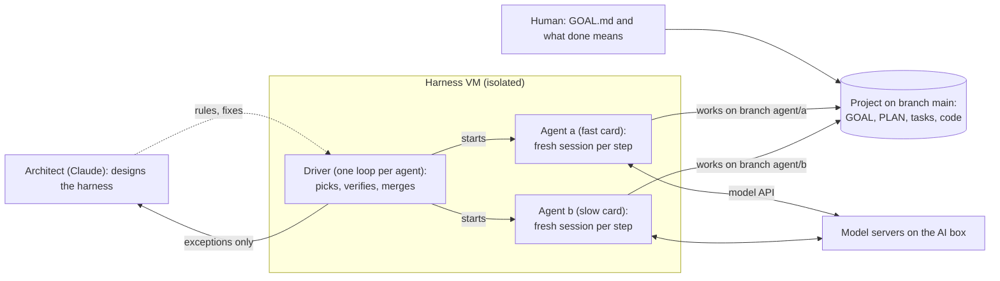

# How the harness works

A plain-language guide to the lab's coding-agent harness: what the pieces are, what happens from a one-page goal to
finished software, how several agents share one project, and which decisions are fixed rules and which are left to
the agent. It is written to be read top to bottom by someone new to the project. The detailed reference (every rule
with the incident that caused it, measurements, experiments) is [agent-harness.md](agent-harness.md); the hardware and
model serving are in [ai-lab.md](ai-lab.md). Terms in **bold** are explained in the [glossary](#glossary) at the end.

## The short version

- A human writes **what** should exist (`GOAL.md`) and owns the definition of done. Local AI agents work out **how**,
  write the code and the tests, and run for hours or days without supervision.
- Agents are disposable. Each **session** is a fresh agent with an empty memory that does one step of one task, writes
  down what it learned, commits and exits. Everything worth remembering lives in files and git.
- A plain bash script, the **driver**, runs everything that must not depend on a model's judgment: which task is next,
  whether "done" is really done, when a session must stop, how work from several agents is merged.
- A cloud model (Claude) is the architect: it turns the human's intent into goals and designs the harness itself. It
  does not steer the agents while they work.
- With several GPUs, several agents build the same project at once, each on its own git branch. The driver hands out
  tasks so the slow card never holds up the fast ones, and an agent with nothing to build prepares notes for the tasks
  that start next.

## The pieces

| Piece | What it is | Its job | What it never does |
|---|---|---|---|
| **Human** | The operator | Writes `GOAL.md`, reviews what gets built, vetoes tasks, answers the agents' rare requests | Write the code |
| **Architect** | A cloud model (Claude) | Turns the human's ideas into goals; designs, tests and fixes the harness from the agents' own session logs | Re-plan or micromanage the agents' tasks |
| **Driver** | `agent-loop` and helpers: bash, no model | Picks tasks, starts sessions, enforces limits, verifies done claims, merges finished work, logs every session | Make a judgment call |
| **Agents** | Qwen3.8-27B (open weights) in the Pi coding agent, one per GPU | Plan, split tasks, write code and tests, run them, take notes, commit | Change what "done" means |
| **Model servers** | vLLM on an RTX 3090 Ti, llama.cpp on an RTX 5060 Ti | Serve the model to the agents over SSH tunnels | Anything else: they only answer requests |



Why a script and not a model in the middle: a model that has lost track of what it is doing cannot be trusted to
notice. A bash `if` on a test exit code cannot be talked into "basically passing". Every rule that mattered was first
tried as an instruction in the agents' prompt; the session logs showed the agents ignoring the prose ones, so they were
moved into code, where they held (see design principle 1 in [agent-harness.md](agent-harness.md#design-principles)).

## A project from start to finish

1. **Goal.** The human makes a folder with a `GOAL.md` in it: what they want, in their own words, and what would make
   it good. For a team project: `agent-team init <name>`, then `agent-team start <name>`.
2. **Plan (task 000).** One agent turns the goal into `PLAN.md` (approach, architecture, tech choices with reasons, which
   task delivers each point of the goal) and a queue of task files. Each task has a goal, acceptance criteria (boxes to
   tick), a `Depends on:` line (tasks that must be finished first) and a `Touches:` line (files it will change). The
   driver checks the plan before accepting it: every task has those lines, no tasks wait on each other in a cycle, and
   a replay of the schedule shows whether files shared between tasks would make them wait (the plan goes back once
   with advice if they would).
3. **Build.** Agents take tasks one session at a time (next section) until each task's boxes are ticked and its tests
   pass. Agents split big tasks and add tasks for what they discover (bugs, missing pieces, refactors).
4. **Verify and merge.** When an agent claims a task is done, the driver checks it: every box ticked, the human's
   criteria untouched, the test suite run twice by the driver. In a team, the accepted branch is merged with everyone
   else's finished work and tested again before it goes into `main`.
5. **Goal check (task 999).** When the queue is empty, one agent checks the whole project against `GOAL.md` point by
   point, with evidence, and adds tasks for anything missing. The loop stops after a check that adds nothing.
6. **Iterate.** The human tries the result and edits `GOAL.md`. The driver notices the change, reopens the plan with the
   difference, and the cycle runs again. The human is notified when the work is done or when an agent needs something
   only a person can do.

## One session, step by step

A session is one agent, started from nothing, doing one step:

1. **Start.** The driver waits until the model server answers (an outage does not burn sessions), picks the task,
   regenerates the code map, merges the latest `main` into the agent's branch (team mode) and builds the prompt: one
   paragraph naming the task file, plus any nudges (this task is big, split it; your teammate is working on X; a
   request you sent was answered).
2. **Orient.** The agent reads its task file (including the hand-over notes from the previous session on it), the
   project overview, the list of known pitfalls, the code map and the git log. Large files (the decision journal, the
   plan) are searched, not read whole. On the first team project this costs about 14k tokens.
3. **Work.** One step: write code, run tests, debug. A command that hangs is killed after 10 minutes; a session that
   produces no output for 15 minutes is stopped; a session never runs longer than 45 minutes.
4. **Hand over.** The agent rewrites the `## Hand-over` section of its task file (where things stand, test state,
   current hypothesis, the exact next step), logs decisions and dead ends in `DECISIONS.md`, commits and stops.
   If its context fills up first (120k tokens on the 3090 Ti, 75k on the 5060 Ti), the harness tells it to stop and
   write its notes; from then on only notes and git work, and a few turns later the session ends regardless.
5. **Close.** The driver saves any code left uncommitted, verifies a done claim if there is one, merges (team mode),
   archives finished journal entries, and writes one line to the ledger: task, duration, result, and the exact harness
   version the session ran under, so every later change can be measured against earlier sessions.

Why this shape: a long-running agent fills its context, gets summarized, and carries on with a blurred memory of its
own work. Short sessions with written hand-overs avoid that, and a session that goes wrong loses at most one step.

## What the agent remembers between sessions

Nothing, except what is written down:

| Memory | What it holds | Who writes it |
|---|---|---|
| Task file, `## Hand-over` | Where this task stands and the exact next step | The agent working on the task |
| `PROGRESS.md` | Overview of tasks in flight and this task's own journal | Generated by the driver before every session |
| `DECISIONS.md` | Journal: choices, failed attempts and why | Agents (finished tasks' entries are archived by the driver) |
| `PITFALLS.md` | Lasting facts: tool quirks, library traps, traps in this codebase, each with where it bites and the symptom | Agents, curated (merged and corrected, not just appended) |
| `CODEMAP.md` | What each file does and where its functions are | Generated from the code before every session |
| `PLAN.md` | The approach and which task delivers what | The planning agent; others search it |
| `tasks/prep/<id>.md` | Notes prepared for a task before it could start (see [prep](#when-an-agent-has-nothing-to-build-prep)) | An idle agent |
| git log | One commit per step | Everyone |

## Who decides what

- **The human owns WHAT.** Task files present when the project starts, plus the plan (000) and the goal check (999),
  are the human's: their acceptance boxes define done, and a done claim that changed one is rejected. An agent that
  thinks a criterion is wrong writes a `## Proposed changes` section instead.
- **The agent owns HOW.** It may split any task, add tasks for work it discovers, rewrite or drop its own tasks, and
  propose new features. New top-level tasks are flagged to the human, who can veto them (`Status: dropped`).
- **The driver owns the rules.** Order of work, limits, verification and merges are code, not suggestions.

## Splitting: the agent's judgment plus fixed triggers

Whether a task is too big is mostly the agent's own call. Its instructions say: at the start of a session, if the task
needs more than a few sessions, splitting it is the step. Agents do this unprompted (on the first team project: 101
into 101a-c, 221 into 221a-d, 213 into 213a-b). The agent cannot see a token counter, so it judges size from the task
and the code, and finds out it misjudged when the context limit hits. The driver nudges at fixed points:

| Trigger (a fixed rule in the driver) | What the agent is told |
|---|---|
| 5 sessions on one task | If what remains is more than a few sessions of work, split it first |
| The context fills to the hand-over limit | If this step turned out too big for one session, split what remains |
| The task is bigger than another running agent's size limit | Split it first, into new top-level tasks the other agent can take |

The driver decides only *that* a split is asked for; *how* to divide the work is the agent's. It can refuse with a
`Split: no - <reason>` line when the work truly cannot be divided.

Two kinds of split: **subtasks** (`025a`, `025b`, ...) belong to the agent that split them, so they stay with it;
**new top-level tasks** can go to any agent. The team rule asks for top-level tasks on purpose, so the other agent gets
work out of it.

## Several agents on one project (team mode)

Each GPU runs its own copy of the model and serves one agent. (Two agents sharing one card measured only 1.06x the
throughput of one: the card's spare capacity is already used by speculative decoding.)

### Branches, claims and merges

- `main` holds finished, verified work only. Each agent works in its own git worktree on its own branch
  (`agent/a`, `agent/b`), and the driver merges `main` into it before every session.
- **Claims.** A task (with all its subtasks) belongs to one agent at a time. A claim survives restarts; it can be taken
  over only if its agent's loop has been gone for two hours.
- A task is offered only when its `Depends on:` tasks are finished in `main`, and never while another agent holds a
  task whose `Touches:` files overlap (two agents editing the same file at once is how merge conflicts happen).
- **Merging.** An accepted task is merged under a lock: `main` into the branch, the tests re-run if `main` brought
  anything new, then `main` fast-forwarded. A conflict or a new test failure reopens the task with the reason.
- Shared memory files merge cleanly by design: journals keep both sides' entries, generated files are regenerated, and
  hand-over notes live in task files, which only the claiming agent edits. New top-level task numbers come from each
  agent's own range, so two branches never create the same number.

### Who takes what: the critical path first

The **critical path** is the longest chain of tasks that must run one after another; nothing finishes faster than that
chain, however many agents there are. Every open task gets a **rank**: the length of the longest chain of open tasks
waiting on it, itself included.

```
230 -> 242 -> 231 -> 233 -> 236 -> 237 -> 238      rank of 230 = 7 (six tasks wait on it in a row)
241 (nothing waits on it)                            rank of 241 = 1 (a leaf)
```

- Fast agents take the highest rank first, so long chains start early.
- A slower agent takes the lowest rank first while a faster agent is running: leaves, which nothing waits on, so a fast
  agent never sits idle waiting for the slow card. Each agent's relative speed is a setting (`TEAM_SPEED`: 4 for a 3090
  class card, 1 for the 5060 Ti). Alone, or with equal speeds, an agent takes the longest chain itself.
- On a replay of the first team project, "lowest number first" (the old rule) left the fast agent idle 5 of 15 task
  lengths; critical-path-first, 3 of 13.

### Size limits: building versus reading

- **Building** has a per-agent size limit: the 5060 Ti agent (114k-token window) takes only tasks that list at most 8
  files (`TEAM_MAX_TOUCHES`). Building fills the context fastest: code read, edits, test output and retries all share
  it. The first team project showed it: the small agent spent whole sessions on a 14-file task without writing
  anything. The limit is a file count, a rough stand-in for context cost (8 tiny files and 8 large ones count the same).
- **Reading** (prep, below) is limited by size instead: the existing files a task touches must fit the agent's
  hand-over limit, less room for its start-up reading and its notes (about 50k tokens, ~200 KB, for the 5060 Ti agent).
- **Handing a task to a bigger agent.** When the small agent has had 3 sessions in a row on a task without ticking a box
  while a bigger agent waits for work, the driver takes the task away from it (its half-done work is kept on a backup
  branch) and the bigger agent gets it.

### When an agent has nothing to build: prep

Idle GPUs are the main cost of team mode: on the first team project (Oct 2-4) the 5060 Ti agent was busy only 44% of
the hours its loop ran (waiting on dependencies 28.5%, during planning 14%, during goal checks 13%). The fast agent was
busy 92%. So an agent that has nothing to build does not wait; it **prepares** a task that starts later:

- **Which task.** Any open, unclaimed task without notes yet that fits its reading budget: the nearest to starting
  first (fewest unbuilt tasks in front of it), then the one with the most work behind it. Deeper tasks are prepared
  too, once nothing nearer is left.
- **What it writes.** `tasks/prep/<id>.md`: assumptions about what each dependency will provide, each marked "seen on
  its branch" (it may read other agents' work in progress, read only), "seen in main" or "inferred"; the plan per
  acceptance box; the tests; risks and open questions. The driver stamps the notes with what they were built on
  ("written 2 steps before the task could start; built on: 230 (being built by agent a), 242 (not started, prep
  notes)"), so whoever uses them knows how much to trust them.
- **Only notes survive.** A prep session may change nothing else: afterwards the driver resets its branch to where it
  started plus one commit with the notes, which go into `main` at once. It cannot ask the human anything (questions go
  into the notes), and it does not count as a session of the task.
- **Real work beats prep (the cut).** Every 20 seconds the driver checks: if the task being prepared can now be built,
  or any task has become free for this agent, it signals the session to write its notes now; the session ends a few
  turns later. The signal is delivered after the model's current turn, so a cut usually takes a few minutes
  (longer on the slow card if it is in the middle of a long thought).
- **The hand-off.** The notes belong to the task, not to the agent that wrote them. Usually the fast agent builds the
  critical-path task: if it claims a task while another agent is still preparing it, it waits for the notes (at most 5
  minutes) and starts from them. Its first prompt says: read the notes, check every assumption against what `main`
  actually has, fix the plan where they are wrong, then build.

A real sequence from the first live day (2026-10-04): agent a builds 230. Agent b, idle, prepares 242 (30 minutes,
assumptions checked against a's branch), then 231. When 230 merges, a takes 242 and starts from b's notes. When 242
merges, b's prep of 231 is cut; a takes 231 (most work behind it) with b's notes, and b takes 241, a one-file task
nothing waits on.

### What still runs on one agent

Planning (000) and the goal check (999) are each done by one agent while the others have nothing to prepare (the plan
may still change every task). On the first team project that was 27% of the small agent's time, partly inflated by two
bugs since fixed. Next: a **streamed plan**, where the planner publishes each finished first-wave task as soon as it is
written, so the other agents start building while it plans the rest.

## When something goes wrong

The driver handles the routine failures itself and reports the rest:

| What happens | What the harness does |
|---|---|
| A command hangs | Killed after 10 minutes; the agent sees where it hung |
| A session goes silent for 15 minutes | Stopped with everything it started; the next session's task file says what hung |
| A done claim fails verification | Task reopened with the reasons in the journal |
| A task runs 8 sessions without finishing | Flagged STALLED (and every 4 sessions after) |
| Tasks wait on each other in a cycle | Logged as a deadlock; one is taken anyway |
| An agent's branch conflicts with `main` | The next session is told to resolve the merge first |
| An agent needs something only a person can do | It files a request (`ask_human`); its task waits, the others continue (a team agent with nothing else to build prepares upcoming tasks meanwhile), and the human gets one encrypted message on their phone, with a reminder every 6 hours |

A watcher reads the team's event log and alerts on conflicts, deadlocks, stale claims, an agent held up 20+ minutes by
a dependency, and loops that died. The human hears about exceptions, requests and finished work; routine progress
stays quiet.

## Settings

Per agent, in `~/.agent-kit/agents/<id>.env` (copied into every new team project by `agent-team init`):

| Setting | What it does | Agent a (3090 Ti) | Agent b (5060 Ti) |
|---|---|---|---|
| `LLM_URL` | Its model server | port 8080 (vLLM) | port 8082 (llama.cpp) |
| `TEAM_SPEED` | Relative speed for task picking | 4 | 1 |
| `TEAM_MAX_TOUCHES` | Build size limit (files on a task's `Touches:` line) | none | 8 |
| `WRAPUP_SOFT_TOKENS` / `WRAPUP_HARD_TOKENS` | Hand-over starts / session ends at this context size | 120k / 142k | 75k / 100k |

Driver-wide (environment, defaults shown): `ITER_TIMEOUT` 2700 s per session, `TEAM_STALE_MIN` 120 (minutes before a
dead agent's claim can be taken), `TEAM_HANDOVER_SESSIONS` 3, `TEAM_PREP` 1 (0 turns prep off),
`TEAM_PREP_HANDOFF_S` 300, `TEAM_PREP_RESERVE_TOKENS` 25000.

## Glossary

| Term | Meaning |
|---|---|
| Session (iteration) | One fresh agent run: start, orient, one step, notes, commit, exit |
| Driver | `agent-loop` plus `agent-team-lib`: the bash script that runs the sessions and enforces the rules |
| Task, subtask | A file in `tasks/` with a goal and acceptance boxes; `025a` is a subtask of `025` |
| Acceptance criteria (boxes) | The checklist that defines done; the human's cannot be changed by agents |
| Hand-over (notes) | The `## Hand-over` section a session leaves for the next one on the same task |
| Handing a task over | The team rule that moves a task from the small agent to a bigger one when it is stuck |
| Claim | One agent's lock on a task and its subtasks |
| Worktree, branch | Each agent's own checkout of the project (`<project>.<id>`, branch `agent/<id>`) |
| `main` | The branch with finished, verified work; agents sync from it, the driver merges into it |
| `Depends on:`, `Touches:` | A task's prerequisites and the files it will change; the scheduler uses both |
| Wave | A group of tasks that can run at the same time |
| Critical path, rank | The longest chain of tasks that must run in order; a task's rank is the length of the chain from it onward |
| Prep, prep notes | Notes an idle agent writes for a task that starts later |
| Cut | The driver's signal that ends a prep session early because real work is free |
| Hand-off | A claiming agent waiting for, and receiving, another agent's prep notes |
| Ledger | One JSON line per session with its result and the exact harness version |
| Goal check | Task 999: the whole project checked against `GOAL.md` |
| Sprint | Everything planned since the planning task last finished |

## Where to read more

- [architecture.md](architecture.md): why the work is split between architect, script and agents.
- [agent-harness.md](agent-harness.md): every rule with the incident behind it, measurements, experiments,
  decisions (including what was decided against), commands.
- [ai-lab.md](ai-lab.md): hardware, model serving, network and security, changelog.
- Code: [harness/driver/](../harness/driver/) (driver), [harness/pi-extensions/](../harness/pi-extensions/) (agent-side
  extensions), [harness/template/AGENTS.md](../harness/template/AGENTS.md) (the rules every agent reads),
  [analysis/tests/](../analysis/tests/) (stub-agent tests for the driver).
